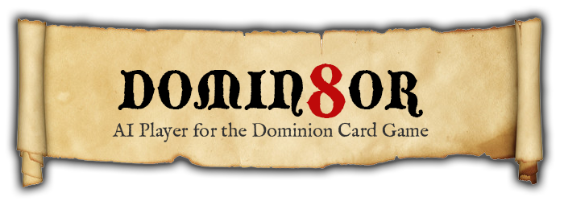

Domin8or
========
**A simulator for the card game Dominion**

## Intro
Domin8or enables you to run simulated games of *Dominion*, a popular card game by Donald X. Vaccarino and Rio Grande 
Games. Domin8or can be used to develop and test new strategies, teach an AI via machine learning, or just waste time.

## Tech Stuff
Domin8or is written as a PHP library, but it can also be accessed via a REST API. The fastest way to get started with 
Domin8or is with Vagrant.

## Requirements
- PHP 7.1+
  - PECL Redis Extension
- Redis Server

## Developers
- Patrick DeLoughry `Core Development`

## Links
- [About Domin8or](http://www.patr1k.com/domin8or)
- [About the Dominion Card Game](https://en.wikipedia.org/wiki/Dominion_(card_game))
- [Dominion by Rio Grande Games](http://riograndegames.com/Game/278-Dominion)